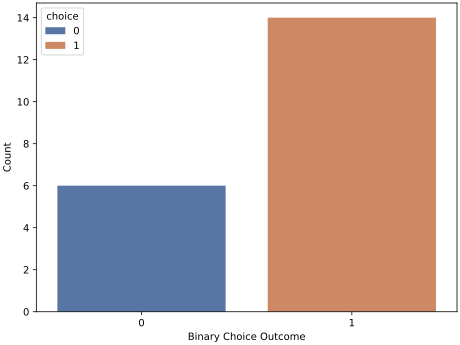
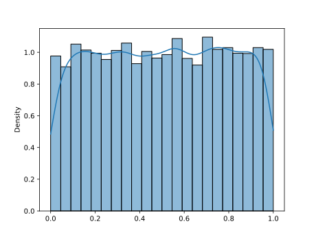
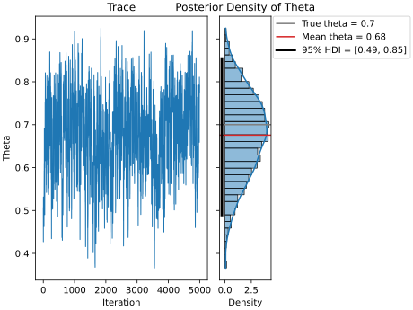

---
title: "Bayesian Inference from Scratch with the MH-Algorithm in Python"
summary: "Get an intuitive understanding of Bayesian inference by sampling the posterior 'by hand'."
showSummary: true
categories: ["Post"]
tags:
  [
    "statistics",
    "bayesian",
    "data-science",
    "machine-learning",
    "probability",
    "python"
  ]
date: 2025-02-26
draft: false
---



When I first explored Bayesian methods, one of the main challenges was understanding the concept of "sampling." What does it mean to sample from the posterior? How does it differ from frequentist fitting approaches, and how is it implemented in code? A straightforward example to explore these questions is a simple implementation of the Metropolis-Hastings (MH) algorithm. This Markov Chain Monte Carlo (MCMC) method is used to sample from the posterior distribution of a Bayesian model. Although it is less sophisticated than modern approaches like the No-U-Turn Sampler used in PyMC and Stan, it remains a valuable tool for building intuition about what happens behind the scenes.

Let's first define the problem we want to solve:

Consider a very simple Bayesian model: you have recorded the choices of many subjects in a binary decision task, where each subject can choose either 0 or 1. We are interested in estimating the population bias towards a particular choice. While you could simply compute the relative frequencies of zeros and ones to estimate this bias, our goal is to also quantify the **uncertainty** associated with that estimate. This is where our binary choice model comes into play.

Since we recorded count data, we can model the likelihood function using a simple Bernoulli model:

$$
y_i \sim \text{Bernoulli}(\theta)
$$

where \\(y\\) represents the choices of the subjects and \\(\theta\\) is the population bias.

Because we have no strong prior expectations about the bias, we will use a weakly informative prior. We know that \\(\theta\\) is a probability (hence it lies between 0 and 1), so we choose a Beta distribution that is uniform between 0 and 1 for our prior on \\(\theta\\):

$$
\theta \sim \text{Beta}(1, 1)
$$

To sample from the posterior, let us first import the necessary packages and define some helper functions:

```python
import numpy as np
from scipy.stats import beta, bernoulli, norm, uniform
import seaborn as sns
import matplotlib.pyplot as plt
from rich.progress import track
import pandas as pd

np.random.seed(42)

def compute_hdi(samples, cred_mass=0.95):
    """
    Compute the Highest Density Interval (HDI) for a given array of samples.
    """
    n_samples = len(samples)
    sorted_samples = np.sort(samples)

    # Number of samples required to cover the desired credible mass
    interval_idx_inc = int(np.floor(cred_mass * n_samples))  # e.g., 4750

    # Total number of possible intervals in the sorted samples
    n_intervals = n_samples - interval_idx_inc

    # Slide a window across the sorted samples
    interval_starts = sorted_samples[:n_intervals]
    interval_ends = sorted_samples[interval_idx_inc:]
    interval_widths = interval_ends - interval_starts

    # Find the index of the smallest interval
    min_idx = np.argmin(interval_widths)

    # The HDI is the smallest interval
    hdi_min = sorted_samples[min_idx]
    hdi_max = sorted_samples[min_idx + interval_idx_inc]

    return hdi_min, hdi_max

```
Now, let's define the likelihood function. As discussed, we use the Bernoulli distribution from `scipy.stats`. Our function returns the probability of the data given the current value of $\theta$. In practice, we build a Bernoulli distribution with the current \\(\theta\\) using `bernoulli(theta)`, then evaluate the probability mass function (`.pmf`) for each data point. Assuming independent observations, we multiply these probabilities together to obtain the likelihood of the full dataset.

```python
def bernoulli_likelihood(theta, data):
    return bernoulli(theta).pmf(data).prod()

```
Next, we need a function that computes the unnormalized posterior probability—that is, the product of the prior and the likelihood, corresponding to the numerator of Bayes' Theorem.

Our function will take the current \\(\theta\\), the data, the prior distribution (our Beta distribution), and the likelihood function (defined above). First, we sanity-check whether \\(\theta\\) is between 0 and 1. If it is, we compute the prior probability of \\(\theta\\), evaluate the likelihood of the data given \\(\theta\\), and then compute the unnormalized posterior by multiplying these two values together. Note that this is Bayes' Theorem in action, but without the normalizing constant.

```python
def posterior_probability(theta, data, prior_dist, likelihood_func):
    if 0 <= theta <= 1:
        prior_prob = prior_dist.pdf(theta)  # Prior probability of theta
        likelihood = likelihood_func(theta, data)  # Likelihood of data given theta
        posterior_prob = (
            prior_prob * likelihood
        )  # Unnormalized posterior (Bayes' Theorem without the constant)
        return posterior_prob
    else:
        return -np.inf

```
Now that we have defined the two necessary functions, let's initialize the sampler and sample from the posterior. First, we generate some data and plot it to visualize what it looks like:

```python
data = bernoulli(0.7).rvs(20)
vals, counts = np.unique(data, return_counts=True)
vals_prob = counts / len(data)
print(f"Outcomes: {vals}, Frequencies: {vals_prob}")
fig, ax = plt.subplots(constrained_layout=True)
plot_data = pd.DataFrame({"choice": vals, "count": counts})
sns.barplot(plot_data, x="choice", y="count", palette="deep", hue="choice", ax=ax)
ax.set_xlabel("Binary Choice Outcome")
ax.set_ylabel("Count")
plt.savefig("hist.svg")
plt.show()

```


Now we can define the prior distribution and our likelihood function.

```python
prior_dist = beta(a=1, b=1)  # theta ~ Beta(1, 1)
likelihood = bernoulli_likelihood  # y ~ Bernoulli(theta)
sns.histplot(prior_dist.rvs(10000), kde=True, stat="density")
plt.savefig("prior.svg")
plt.show()

```


Next, let's initialize the sampler. We set the sampler to run for 5000 iterations and create an array to store the samples. For the initial value of \\(\theta\\), we choose the mean of the prior distribution (0.5) as a starting point. We also define a proposal distribution from which new candidate values of \\(\theta\\) are drawn. Here, we use a simple normal distribution with a standard deviation of 0.05.

```python
num_iterations = 5000
samples = np.zeros(num_iterations)
current_theta = prior_dist.mean()  # Initialize theta at the mean of the prior (0.5)
proposal_std = 0.05  # Standard deviation of the proposal distribution

```
We can now estimate the unnormalized posterior probability of the current initial value of $\theta$:

```python
current_posterior = posterior_probability(current_theta, data, prior_dist, likelihood)
```
With everything set up, let's run the sampler. In each iteration, the sampler first draws a new candidate from the proposal distribution and computes its unnormalized posterior probability (i.e., the probability of the candidate given the data).

Using the current and candidate unnormalized posteriors, we compute the acceptance ratio by simply dividing the candidate's posterior by the current posterior. This is the key step in the MH algorithm—notice how the marginal probability (which would be difficult to compute) cancels out in the ratio.

This step is what gives the algorithm its Markov Chain property: the decision to move to the candidate state depends solely on the current state and the acceptance ratio. By generating a random number between 0 and 1 and comparing it to the acceptance ratio, we decide whether to accept the candidate. This stochastic acceptance is crucial for ensuring that the chain can escape local maxima and thoroughly explore the tails of the distribution and is also the Monte-Carlo sampling part of the algorithm.

```python
for i in track(range(num_iterations), description="Sampling posterior..."):
    # Propose a new candidate (Monte Carlo Sampling)
    candidate_theta = norm(current_theta, proposal_std).rvs()

    # Compute the posterior probability of the candidate
    candidate_posterior = posterior_probability(
        candidate_theta,
        data,
        prior_dist,
        likelihood,
    )

    # Compute the acceptance ratio
    acceptance_ratio = candidate_posterior / current_posterior  # (Markov Chain update)
    # Both are computed as unnormalized posteriors: prior * likelihood
    # The normalizing constant cancels out!

    # Accept the candidate with probability equal to the acceptance ratio
    if acceptance_ratio > uniform(0, 1).rvs():
        current_theta = candidate_theta
        current_posterior = candidate_posterior

    samples[i] = current_theta

```
After drawing all the samples, we can examine the trace of our samples across iterations and view the resulting posterior distribution (which is simply the distribution of our samples). For example, we can compute the mean of the posterior, which turns out to be around 0.68, with a 95% HDI of [0.49, 0.85]. Thus, we can say:

> Given our prior, the data, and our model, there is a 95% chance that the true bias lies between 0.49 and 0.85.

Note that this wide interval is partly due to the fact that we simulated only 20 data points.

```python
mean_theta = samples.mean()
hdi_min, hdi_max = compute_hdi(samples, cred_mass=0.95)
print(f"Mean theta = {mean_theta:.2f}, 95% HDI = [{hdi_min:.2f}, {hdi_max:.2f}]")

```
Examining the trace and the posterior distribution, we see that the posterior is centered around 0.7 with a 95% HDI of [0.49, 0.85]. The trace plot shows that while we started at 0.5 (the mean of our uniform Beta prior), the chain eventually moves towards around 0.7 and then fluctuates within a certain range. This range reflects the stationary distribution of our Markov Chain, which represents our posterior distribution.

```python
fig, axs = plt.subplots(
    1, 2, width_ratios=[5, 1.5], constrained_layout=True, sharey=True
)
axs[0].plot(samples, lw=1)
sns.histplot(y=samples, ax=axs[1], kde=True, stat="density")
axs[1].axhline(y=0.7, color="grey", label="True theta = 0.7")
axs[1].axhline(
    y=mean_theta,
    color="tab:red",
    label=f"Mean theta = {mean_theta:.2f}",
)
axs[1].plot(
    [-0.3, -0.3],
    [hdi_min, hdi_max],
    color="k",
    label=f"95% HDI = [{hdi_min:.2f}, {hdi_max:.2f}]",
    lw=3,
)
axs[1].legend(bbox_to_anchor=(1.04, 1), borderaxespad=0)
axs[0].set_title("Trace")
axs[0].set_xlabel("Iteration")
axs[0].set_ylabel("Theta")
axs[1].set_title("Posterior Density of Theta")
axs[1].set_xlabel("Density")
axs[1].set_ylabel("Theta")
plt.savefig("trace.svg")
plt.show()

```


Congratulations on working through the MH-algorithm! You now know how to sample from a posterior distribution using the Metropolis-Hastings algorithm. I invite you to run this script on your own machine and experiment with different parameters. For instance, you will quickly observe that generating more data causes the credible intervals around our parameter estimate for $\theta$ to shrink. Additionally, try modifying the prior: if you skew the Beta distribution in one direction, you will significantly alter the shape of the posterior. This [link](2_binary_choice_task_metropolis_hastings_blogpost.py) will take you to the script I used to generate this post, you can just copy-paste it and run it.

In practice, these algorithms are extended to efficiently handle much more complex models. However, the MH-algorithm remains a great starting point for developing intuition about how modern probabilistic programming frameworks work behind the scenes.

Thanks for reading!
